# 03 — Zotero + Better BibTeX 詳細設定

本文件詳細說明如何用 Zotero 管理參考文獻，並透過 Better BibTeX 擴充自動匯出 `.bib` 檔案供 Pandoc 編譯使用。

## 為什麼用 Zotero + Better BibTeX？

- **Zotero**：免費開源的文獻管理工具，跨平台、瀏覽器擴充可一鍵抓取論文資訊
- **Better BibTeX**：自動產生穩定的 citation key（如 `vaswani2017attention`）、自動匯出 `.bib` 到指定路徑
- **比 Mendeley/EndNote 的優勢**：
  - 完全免費、無容量限制（自架同步）
  - citation key 規則可自訂
  - 變更條目時自動更新 .bib，寫作時無感同步

## Step 1：安裝 Zotero

從官網下載安裝：<https://www.zotero.org/download/>

支援 Windows、macOS、Linux。安裝後可選擇是否註冊 Zotero 帳號（建議註冊，可雲端同步）。

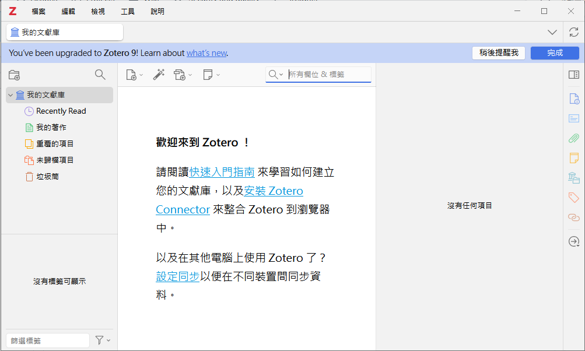

## Step 2：安裝 Better BibTeX

1. 到 Better BibTeX GitHub 頁面下載最新 .xpi 檔：<https://github.com/retorquere/zotero-better-bibtex/releases>

   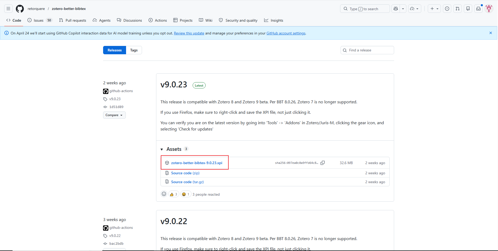

2. 在 Zotero 中：`Tools` → `Add-ons`

   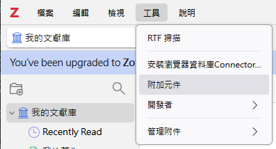

3. 點右上齒輪 → `Install Add-on From File...`

   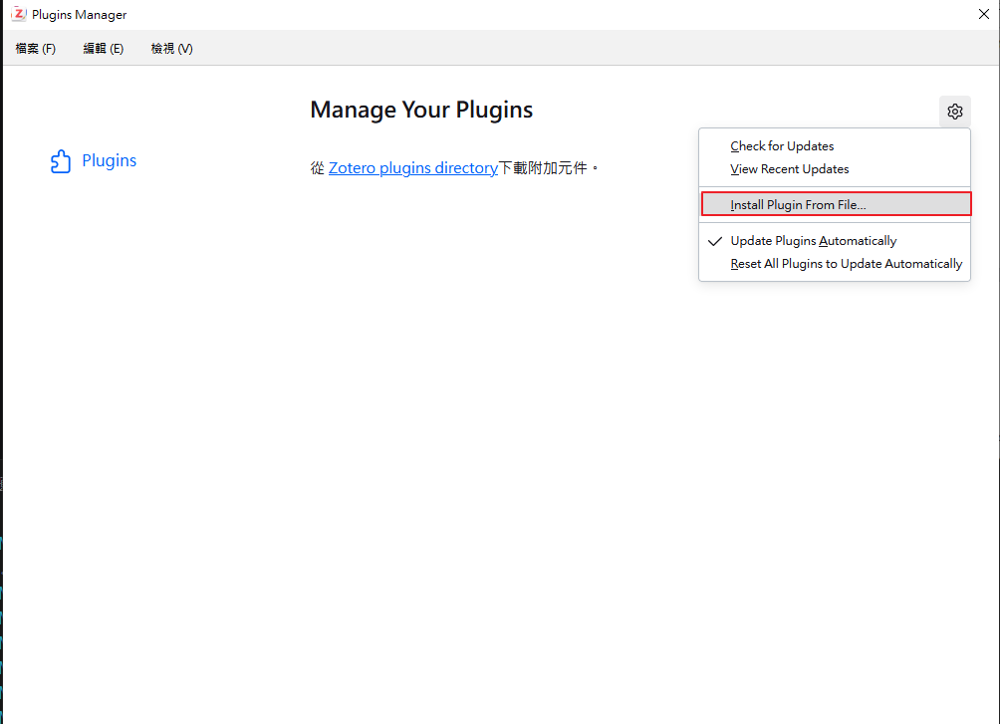

4. 選剛下載的 .xpi

   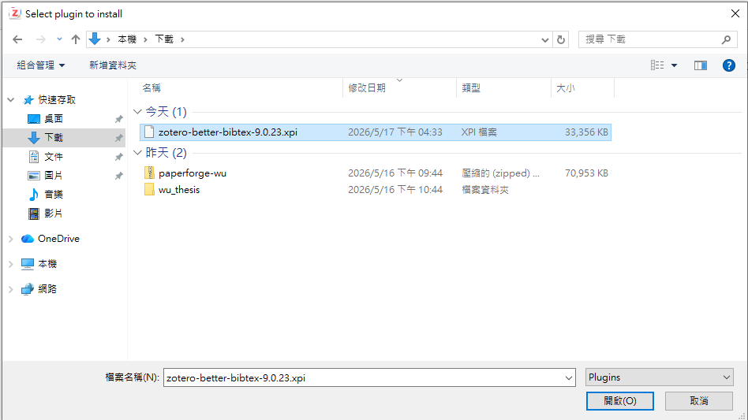

5. 重啟 Zotero，確認 Better BibTeX 已出現在 Add-ons 清單中

   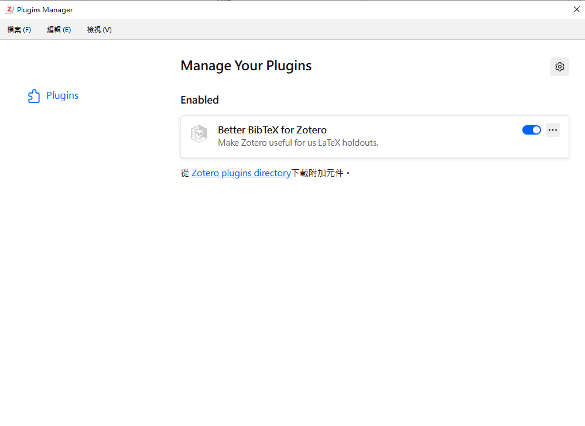

## Step 3：設定 Citation Key 命名規則

`Edit` → `Preferences` → `Better BibTeX` → `Citation Keys` 標籤

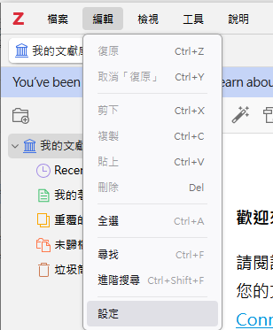

建議的 Citation key formula：

```
authEtAl + year + shorttitle(2,2)
```

範例結果：
- `vaswani2017AttentionAll` (Attention Is All You Need)
- `heResNet2016DeepResidual` (Deep Residual Learning for Image Recognition)

也可以選簡單版：

```
auth.lower + year
```

範例：
- `vaswani2017`
- `he2016`

注意如果同年多篇可能重複，會自動加 `a/b/c`。

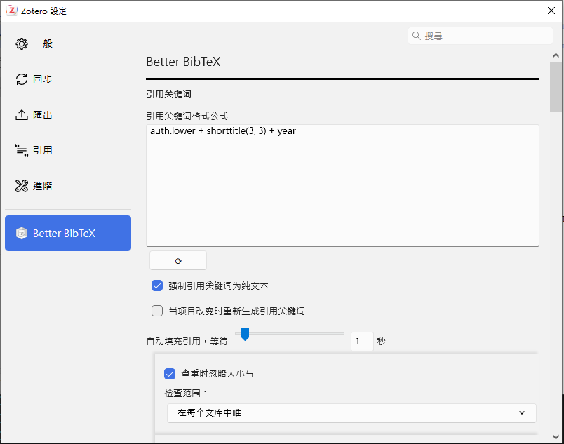

設定完後，**右鍵點選現有文獻** → `Better BibTeX` → `Refresh BibTeX key`，把舊條目套用新規則。

## Step 4：建立論文 Collection

在 Zotero 主介面：

1. 左側欄右鍵 → `New Collection`

   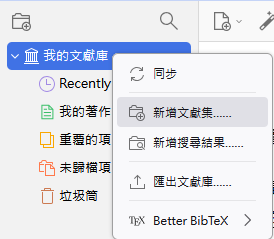

2. 命名（例如：「我的碩論」）

   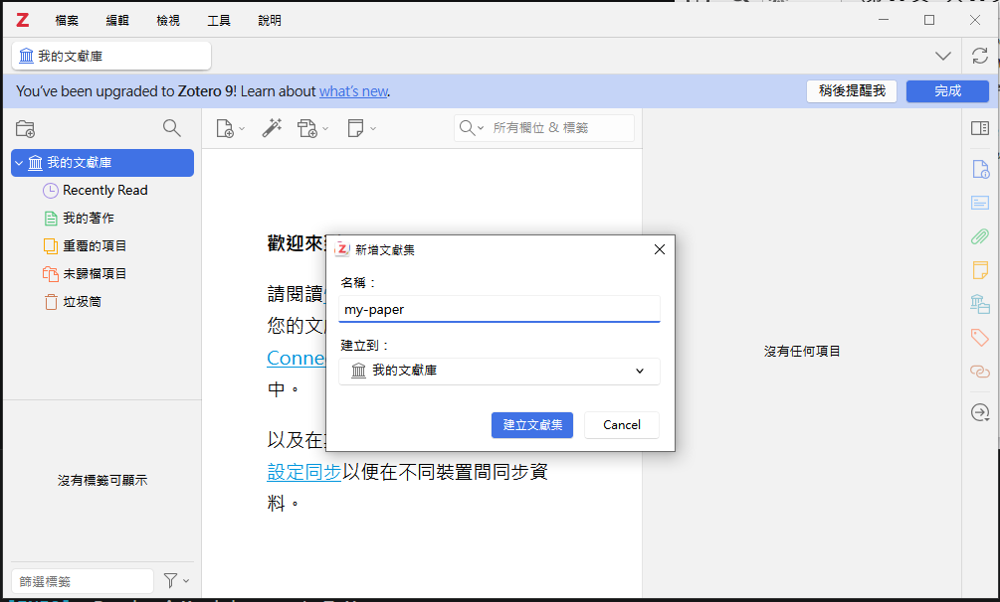

3. 把所有要引用的文獻拖進此 collection（下一步會教如何用瀏覽器擴充快速抓取）

## Step 5：新增第一篇文獻到 Collection

> ⚠️ **重要**：Better BibTeX **不允許匯出空的 Collection**（會跳警告），所以在設定下一步的自動匯出前，請先確保 Collection 至少有一篇文獻。

最快的方式是使用 Zotero 的瀏覽器擴充（[Zotero Connector](https://www.zotero.org/download/connectors)）：

- **抓取論文頁面**（arXiv、IEEE、ACM、Springer 等學術資料庫）：點瀏覽器右上的 Zotero 圖示，它會自動辨識為論文並抓取完整 metadata（標題、作者、年份、DOI、PDF）

  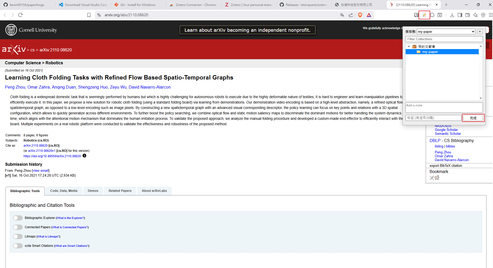

- **抓取一般網頁**：圖示會變成網頁／書本圖樣，可儲存為 webpage 或 book section

  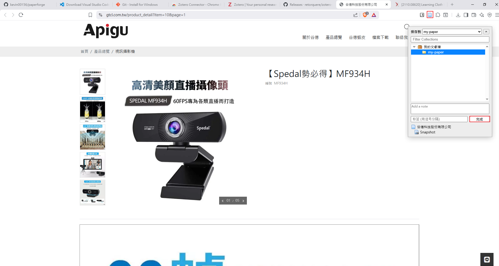

抓取時可在彈出視窗指定目標 Collection；若沒指定則先進 `My Library`，再手動拖進剛建立的 Collection 即可。

## Step 6：設定自動匯出

**這是關鍵步驟**。讓 Better BibTeX 監看你的 collection，每次新增/修改文獻時自動更新 `.bib` 檔。

1. 右鍵剛建立的 Collection → `Export Collection...`

   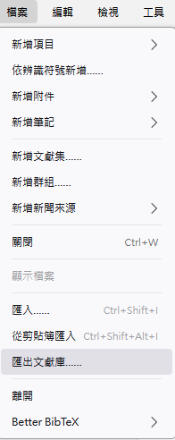

2. Format 選 **Better BibTeX**（不是 Better BibLaTeX）
3. 勾選 **Keep updated**
4. 點 OK

   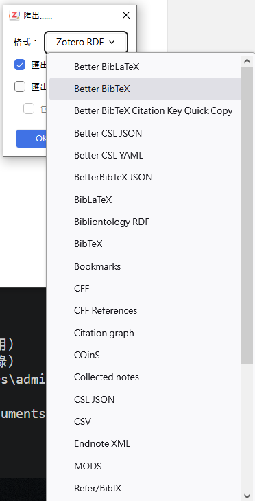

   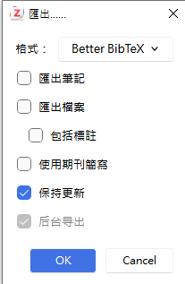

5. 在彈出的儲存對話框中，導航到你的論文資料夾 `my-thesis/`，存檔名為 `references.bib`

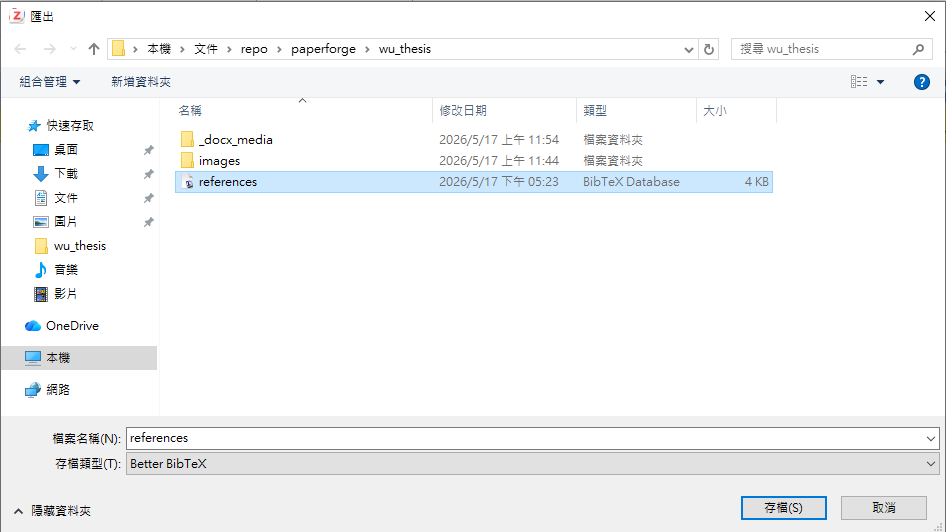
設定完成後，**每次在 Zotero 中新增/編輯文獻，`references.bib` 會自動更新**，無需手動操作。

> 💡 如果這一步跳出「Cannot export empty collection」或類似警告，代表 Step 5 還沒做完 — 回去先抓一篇文獻進 Collection 再回來匯出。

## Step 7：驗證自動更新

確認「新增文獻 → .bib 自動更新」的迴圈確實運作：

1. 在 Zotero 中再新增一筆文獻（例如用瀏覽器擴充抓取另一篇 arXiv 論文），拖進你的 Collection
2. 開啟 `my-thesis/references.bib`，應該看到新條目已自動加入（可能需要等 1-2 秒）
3. 在 `paper.md` 中用 `[@citation-key]` 引用該文獻
4. 編譯 paper.md，確認 PDF 中出現引用編號與參考文獻列表

## 進階：路徑包含中文

如果論文資料夾路徑含中文（例如 `D:\我的論文\`），某些版本 Better BibTeX 可能匯出失敗。建議：

- 把論文資料夾移到全英文路徑（推薦）
- 或在 Zotero `Preferences` → `Advanced` → `Config Editor` 中搜尋 `better-bibtex.autoExportDelay`，調大延遲時間

## 進階：多人協作論文

如果是多人合著、需共享 `.bib`：

1. **方案 A**：用 Git 追蹤 `references.bib`，每人各自 Zotero 匯出自己負責的部分
2. **方案 B**：用 Zotero Group Library，多人共用一個 Collection，分別在自己機器設定自動匯出
3. **方案 C**：把 `references.bib` 放到雲端（Dropbox/OneDrive），但只一人負責 Better BibTeX 匯出，其他人 read-only

## 常見問題

### Q: Better BibTeX 匯出的 .bib 中有 `file = {...}` 路徑欄位，會洩漏我的本機路徑

A: 在 `Preferences` → `Better BibTeX` → `Export` → `Fields` 中，把 `file` 加入 `omit fields` 清單。

或者在匯出後手動處理：

```bash
# 移除 file 欄位的簡單腳本
sed -i '/^\s*file\s*=/d' references.bib
```

### Q: Citation key 經常變動

A: 確保已在 Preferences 中勾選 `Citation Keys` → `On item change` → `Keep key when adding new items`。

### Q: 中文期刊條目顯示亂碼

A: 確認 .bib 檔以 UTF-8 編碼儲存（Better BibTeX 預設正確，但若手動編輯需注意）。

### Q: Pandoc 編譯時找不到引用

A: 確認 `paper.md` 的 YAML 中 `bibliography: references.bib` 路徑正確（相對於 paper.md 的位置）。

### Q: 匯出時跳「Cannot export empty collection」警告

A: Better BibTeX 不允許匯出空的 Collection。先依 Step 5 加入至少一篇文獻再匯出即可。

## 下一步

- 開始撰寫：[02-writing-workflow.md](02-writing-workflow.md)
- Pandoc 引用語法：[04-pandoc-syntax.md](04-pandoc-syntax.md#引用)
